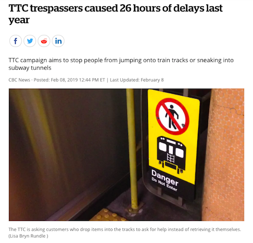

```{r setup, include=FALSE}
options(htmltools.dir.version = FALSE, dplyr.width = Inf)
knitr::opts_chunk$set(dpi = 300)
```

# About me

.pull-left[
Statistician at the College of Nurses of Ontario.

R user for almost 10 years.

Twitter: @sharlagelfand

Blog: [sharla.party](https://sharla.party)

Slides:

]

.pull-right[

*Vicky Leta / Mashable*
]

---
class: center, middle


*[https://www.cbc.ca/news/canada/toronto/ttc-trespassing-campaign-1.5011407](https://www.cbc.ca/news/canada/toronto/ttc-trespassing-campaign-1.5011407)* 

???

Campaign - don't go on tracks to get items

Not worth your life

Unauthorized people at track level causes 26 hours of delays in 2018

---
layout: true
# TTC Delays

---

How did this "unauthorized person on track level" delay vary from line to line?

What are the other main causes of delays?

2018 delays available from [Toronto Open Data](https://www.toronto.ca/city-government/data-research-maps/open-data/open-data-catalogue/transportation/#917dd033-1fe5-4ba8-04ca-f683eec89761).

Let's answer some of my questions and go over some strategies about how to work with a new data set.

---

```{r delays-raw, include=FALSE}
set.seed(12345)
library(dplyr)
library(ggplot2)

theme_set(theme_minimal() + theme(axis.text.x=element_blank(), axis.ticks.x=element_blank()))

delays_clean <- fs::dir_ls("delays") %>%
  purrr::map_dfr(readxl::read_excel) %>%
  janitor::clean_names()

delay_codes <- readxl::read_excel("Subway & SRT Log Codes.xlsx") %>%
  janitor::clean_names()

delay_codes <- delay_codes %>%
  select(code = sub_rmenu_code, description = code_description_3) %>%
  bind_rows(
    delay_codes %>%
      select(code = srt_rmenu_code,
             description = code_description_7)
  ) %>%
  filter(!is.na(code))

delays_clean <- delays_clean %>%
  left_join(delay_codes) %>%
  select(date, time, station, code, description, min_delay, bound, line)

delays <- delays_clean %>%
  mutate(min_delay = ifelse(row_number() %in% sample(1:nrow(delays_clean), nrow(delays_clean)*0.05), NA_integer_, min_delay),
         date = as.Date(date)) %>%
  filter(!(line %in% c("BLOOR DANFORTH LINES", "YONGE UNIVERSITY SERVI")))
```

```{r delays}
head(delays)
```

Some qualities of this data were doctored (by me) for the purpose of Making A Point.

???

min_delay - Delay (in minutes) to subway service

---

Top 5 causes for delay along each line (YU, BD, SHP, and SRT).

```{r delays-analysis, eval=FALSE}
library(dplyr)
library(ggplot2)

delays %>%
  group_by(line, code) %>%
  summarise(delays = sum(min_delay)) %>%
  arrange(-delays) %>%
  slice(1:5) %>%
  ggplot(aes(x = code,
             y = delays)) +
  geom_col() + 
  facet_wrap(vars(line), 
             scales = "free_y",
             nrow = 4) +
  coord_flip()
```

---

```{r delays-analysis-output, ref.label="delays-analysis", echo=FALSE, warning=FALSE, fig.asp=0.60}
```

Immediate issues -- other "lines", inconsistent coding.

???

Not what I expected, not what documentation says, inconsistent coding.

---

```{r delays-main-lines, eval=FALSE}
delays %>%
  filter(line %in% c("BD", "YU", 
                     "SHP", "SRT")) %>% 
  ... same code as before
```

```{r delays-main-lines-output, echo=FALSE, fig.asp=0.45}
delays %>%
  filter(line %in% c("BD", "YU", 
                     "SHP", "SRT")) %>% 
  group_by(line, description) %>%
  summarise(delays = sum(min_delay)) %>%
  arrange(-delays) %>%
  slice(1:5) %>%
  ggplot(aes(x = description,
             y = delays)) +
  geom_col() + 
  facet_wrap(vars(line), 
             scales = "free_x",
             nrow = 1) +
  coord_flip() + 
  theme_minimal(base_size = 15) + 
  theme(axis.text.x = element_blank(),
        axis.title = element_blank())
```

Where's "Unauthorized at Track Level?"

---

Look at delay from campaign, "Unauthorized at Track Level"

--

```{r suut-delays-na, eval=FALSE}
delays %>%
  filter(description == "Unauthorized at Track Level") %>%
  group_by(line) %>%
  summarise(delays = sum(min_delay))
```

--

```{r suut-delays-na-output, ref.label="suut-delays-na", echo=FALSE}
```

--

Easy to remove `NA`s, but lurking consequences -- top 5 delays are wrong now too (any delays with `NA` wouldn't be considered).

Some issues don't raise red flags, which is the worst of all.

---
layout:false

# Strategies for working with new data

How can you avoid this back and forth?

Nicer to know *what* kind of issues you'll have to handle.

Not reliant on "doing something with a specific variable" to spot an issue with it.

---
class: center, inverse, middle

# `r emo::ji("mag")` Visual summaries `r emo::ji("mag")`

Learn about your data as fast as possible.

???

Simple, but powerful. Learn as much as you can about your data as fast as you can. Structure and attributes.

---

# `visdat` package

Visual overview of data structure and missingness, created by [Nick Tierney](https://www.njtierney.com/).

--

```{r visdat-delays, eval=FALSE}
library(visdat)

vis_dat(delays)
```

```{r visdat-delays-output, echo=FALSE, out.width="80%", fig.asp=0.50}
library(visdat)

delays %>%
  vis_dat() +
  theme_minimal(base_size = 18) + 
  theme(axis.text.x = element_text(angle = 45, hjust = 0))
```


--

Learn things about your data that weren't clear in the first 10 lines.

---

# `visdat` package

```{r vismiss-delays, eval=FALSE}
vis_miss(delays)
```

```{r vismiss-delays-output, echo=FALSE, out.width="80%", fig.asp=0.50}
delays %>%
  vis_miss() +
  theme_minimal(base_size = 18) + 
  theme(axis.text.x = element_text(angle = 45, hjust = 0))
```

--

What does it *mean* if `bound` is missing? Both directions? Specific `code`s?

???

Better understand missingness. What % of data missing, what % for each variable. 

Follow up on questions by exploring data more, looking for documentation, or asking people. 

If we did this first, would have known `min_delay` was missing and handled that straight away.

---

# Variable summaries

Attributes and possible values of each variable.

--

```{r summary-min-delay, eval=FALSE}
summary(delays[["min_delay"]])
```

--

```{r summary-min-delay, ref.label="summary-min-delay", echo=FALSE}
```

--

```{r summary-line, eval = FALSE}
summary(delays[["line"]])
```

--

```{r summary-line-output, ref.label="summary-line", echo=FALSE}
```

--

`summary()` is very general. Sometimes it contains good information, sometimes it doesn't tell you anything at all.

---

# `skimr` package

Gives summary statistics that you can quickly *skim* to understand your data, maintained by [Elin Waring](https://elinwaring.org/) and [Michael Quinn](http://michaelquinn32.github.io/).

--

Conforms to the principle of least surprise:

* Design should match the user's experience, expectations, and mental models.

--

* If it doesn't, you should find out quickly!

--

Good way to develop a mental model if you *don't* have one.

???

Shows summary statistics for each variable, separated by class.

---

```{r delays-skim, eval=FALSE}
library(skimr)

skim(delays)
```

--

```{r delays-skim-output, ref.label="delays-skim", echo=FALSE}
```

The results are surprising, but good to know *now* instead of post iffy analysis.

???

Review output of each type, point out:

* 6 unique values of bound
* Lines
* Stations
* Range for min_delay and min_gap

Friendlier to find out now than when you have weird results and have to figure out why.

---

# `skimr` package

What are the different values of `bound`, for each `line`?


```{r skim-delays-bound-line, eval=FALSE}
delays %>%
  filter(line %in% c("BD", "B/D", "YU", "SHP", "SRT")) %>%
  mutate(bound = as.factor(bound)) %>%
  group_by(line) %>%
  skim(bound)
```

--

```{r skim-delays-bound-line-output, echo=FALSE, ref.label="skim-delays-bound-line"}
```

???

initial skim points us in direction of other things to investigate 

skim within group, factor is good, select a single line

bd is east/west, but some north delays. yu is north south, some east. was bound coded incorrectly? or maybe line? if delay at bloor/yonge. 

---
# Visual summaries

Help to verify or develop a mental model.

--

Highlight inconsistencies, indicate areas for further investigation.

--

Reliant on a person (you) looking at output.

--

(And remembering what you're looking for).

--

(And not leaving the project or your job).

---
class: middle, center, inverse

# `r emo::ji("speaking_head")` Opinionated strategies `r emo::ji("speaking_head")` 

Codify assumptions so that your analysis fails if they're not met.

???

Explicit, code fails loudly and spectacularly if not met. 

Better than case where assumptions not met but analysis looks "ok"

---

# `assertr` package

Verify assumptions about data *early* in a pipeline. Created by [Tony Fischetti](http://www.onthelambda.com/).

--

Forces you to outline assumptions about data, and alerts you of any deviations.

--

Can help save you from the case where an analysis "look okay" but produces inaccurate results.

---
layout:true
# `assertr` package

---

Use `assert()` for assumptions about columns of a data set.

--

Throws an error and stops execution if the assumptions are violated.

--

Returns original data set if assumptions are met.

--

Let's say I assume `line` is YU, BD, SHP, or SRT.

--

```{r assert-line, eval=FALSE}
library(assertr)

delays %>%
  assert(in_set("YU", "BD", "SHP", "SRT"), line)
```

--

```{r assert-line-output, error=TRUE, ref.label="assert-line", echo=FALSE}
```

???

returns an error that the assertion was violated 3443 times

shows the first few lines where this is true (with `index` as the row number)

values that violate that assumption

---

.center[


*Mrs. Decatur's Little Gators*
]

--

`in_set("YU", "BD", "SHP", "SRT")` says that the subject, `line`, only has values in the set "YU", "BD", "SHP", "SRT".

???

predicate says something about the properties or actions of a subject. says what values line takes on.


---

`in_set()`: checks that each value is within a set.

--

`within_bounds()`: checks that each numeric value is within the bounds

```{r min-delay-positive, eval=FALSE}
delays %>%
  assert(within_bounds(0, Inf), min_delay)
```

--

```{r min-delay-positive-out, error=TRUE, echo=FALSE, ref.label = "min-delay-positive"}
```

(It allows `NA`s by default)

---

`not_na()`: checks that each element is not NA.

```{r, error=TRUE}
delays %>%
  assert(not_na, min_delay)
```

--

`is_uniq()`: checks if each value is unique; useful for IDs.

--

DIY! write a function that returns TRUE/FALSE.

???

could have used within_bounds() without na and ALSO used not_na() to check separately, e.g. not negative but also not missing

---

`assertr` functions are designed to be piped together.

By default, the first deviation will stop the pipe and return errors.

--

```{r assert-chain-fail, eval=FALSE}
delays %>%
  assert(in_set("YU", "BD", "SHP", "SRT"), line) %>%
  assert(within_bounds(0, Inf), min_delay) %>%
  assert(not_na, min_delay)
```

--

```{r assert-chain-fail-outout, echo=FALSE, error=TRUE, ref.label="assert-chain-fail"}
```

--

Only names one violation.

---

Use `chain_start()` and `chain_end()` to get all errors.

--

```{r assert-chain, error=TRUE, warning=FALSE, eval=FALSE}
delays %>%
  chain_start() %>%
  assert(in_set("YU", "BD", "SHP", "SRT"), line) %>%
  assert(within_bounds(0, Inf), min_delay) %>%
  assert(not_na, min_delay) %>%
  chain_end()
```

--

```{r assert-chain-outout, echo=FALSE, error=TRUE, ref.label="assert-chain"}
```

???

overwrite default behaviour, append information about *all* errors

---

When all assumptions are satisfied, the result is just the original data set.

It can be piped directly for analysis. 

--

```{r, include=FALSE}
delays_clean <- delays_clean %>%
  mutate(line_clean = case_when(line %in% c("BD", "B/D", 
                                            "BLOOR DANFORTH LINES") ~ "BD",
                                line %in% c("YU", "YUS",
                                            "YONGE UNIVERSITY SERVI") ~ "YU",
                                line == "SHP" ~ "SHP",
                                line == "SRT" ~ "SRT")) %>%
  filter(!is.na(line_clean),
         !is.na(min_delay)) %>%
  select(-line, line = line_clean)
```

```{r assumptions-met-plot, eval=FALSE}
delays_clean %>% 
  chain_start() %>%
  assert(in_set("YU", "BD", "SHP", "SRT"), line) %>%
  assert(within_bounds(0, Inf), min_delay) %>%
  assert(not_na, min_delay) %>%
  chain_end() %>%
  group_by(line, description) %>%
  summarise(delays = sum(min_delay)) %>%
  arrange(-delays) %>%
  slice(1:5) %>%
  ggplot(aes(x = description,
             y = delays)) +
  geom_col() + 
  facet_wrap(vars(line), 
             scales = "fixed",
             nrow = 1) +
  coord_flip()
```

---

```{r asumptions-met-plot-output, echo=FALSE, ref.label="assumptions-met-plot", out.width="100%", fig.asp=0.55}
```

--

Where's "Unauthorized at track level"? `r emo::ji("thinking")`

---
layout:false

# Wrapping up

`r emo::ji("swim")` Be weary of diving right into results.

--

`r emo::ji("mag")` Efficiently visualize your data to verify or build mental models.

--

`r emo::ji("hole")` Be liberal with rabbit holes, investigations, and edge cases.

--

`r emo::ji("speaking_head")` Codify your assumptions so that it is them, not you, who fail spectacularly!

---

# Thanks!

[Toronto Open Data](https://www.toronto.ca/city-government/data-research-maps/open-data/)

[`visdat` package vignette](http://visdat.njtierney.com/articles/using_visdat.html)

[`skimr` package vignette](https://cran.r-project.org/web/packages/skimr/vignettes/Using_skimr.html)

[`assertr` package vignette](https://cran.r-project.org/web/packages/assertr/vignettes/assertr.html)

[ROpensci](https://ropensci.org/)

Slides:

Twitter: @sharlagelfand

